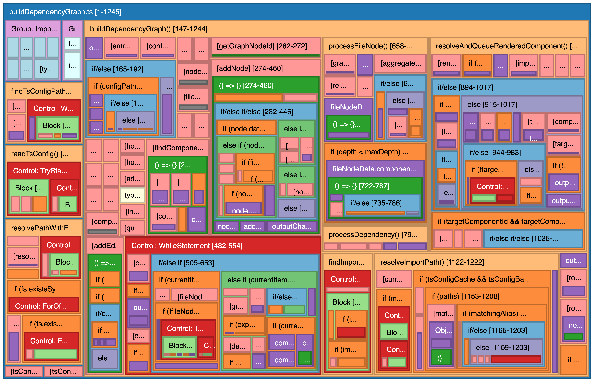

# React TypeScript Code Analysis VS Code Extension

Provides static analysis, visualization, and code navigation features for React + TypeScript projects within Visual Studio Code.

Example treemap of itself:



## Features

- **Treemap Visualization**: Visualize your codebase structure using an interactive treemap.
  - **Custom Implementation**: Uses a hand-rolled treemap implementation with binary layout algorithm for optimal performance and customization.
  - **Hierarchical Value Calculation**: Each leaf node (child without children) has a value of 1, and parent nodes recursively sum their children's values. This provides meaningful size representation where larger containers automatically reflect their complexity through the sum of their components.
  - **Grid-Based Layout Algorithm**: Advanced layout system that intelligently subdivides space to create optimal rectangle sizes for text display:
    - **Text-First Approach**: Layout decisions prioritize displaying 10-15 characters per node for optimal readability
    - **Smart Grid Generation**: Automatically calculates optimal column counts based on available space and content
    - **Multi-Layout Comparison**: Evaluates vertical stacks, horizontal layouts, and grid arrangements to find the best fit
    - **Width Constraints**: Prevents overly wide rectangles by breaking them into columns when beneficial
    - **Header Priority**: Ensures headers always get adequate space for readable text labels
  - **Container Padding System**: Intelligent padding system that ensures child nodes are rendered properly inside their parent containers:
    - **Layout-Integrated Padding**: Padding is calculated during the layout phase, not just for visual rendering
    - **Hierarchical Spacing**: Parent nodes automatically reserve space for padding, positioning children inside the padded area
    - **Depth-Aware Padding**: Padding is only applied to non-root nodes to avoid wasting space at the top level
    - **Visual Container Boundaries**: Parent containers render with subtle borders to clearly delineate hierarchical structure
  - **Infinite Depth Rendering**: Supports rendering nested code structures to unlimited depth with intelligent visual scaling.
  - **Dynamic Visual Hierarchy**: Header and body sections automatically adjust size, opacity, and stroke width based on nesting depth.
  - **Smart Layout Algorithm**: Enhanced binary layout with aspect ratio optimization and minimum size constraints for deeply nested nodes.
  - **Header and Body Rendering**: Each node has a customizable header (dynamic height) and body section, allowing for rich visual representation.
  - **Improved Group Placement**: Fixed rendering issues where child nodes were appearing faint or misplaced within parent groups.
  - **Enhanced Visibility**: Optimized opacity calculations to ensure nodes remain visible at deeper nesting levels (minimum 60% opacity for leaf nodes, 80% for headers).
  - **Robust Coordinate System**: Improved coordinate calculations and bounds checking to prevent rendering artifacts and ensure proper node positioning.
  - **Group Border Management**: Enhanced border rendering system that properly handles group selection and highlighting:
    - **Group-Level Selection**: When parent nodes are selected, borders are drawn around the entire group container, not just the header
    - **Hierarchical Border Logic**: Group containers get prominent selection borders (red for selected, gold for search matches) while child elements use subdued borders to avoid visual conflicts
    - **Smart Border Inheritance**: Headers and leaf nodes within selected groups use darker, thinner borders that complement the main group border
    - **Consistent Visual Hierarchy**: All parent nodes with children get container borders for clear visual grouping, regardless of depth
  - Node sizes can represent lines of code or character counts, providing an intuitive overview of code distribution.
  - Color-coded categories for different code elements (modules, components, functions, etc.).
  - Interactive features like zoom, tooltips with detailed information (ID, category, value, source snippet), and customizable display settings.
  - Export the treemap as a PNG image or the underlying data as JSON.
  - **Search Functionality**: Filter and highlight nodes based on their content (see [Search Feature](#search-feature) below).
  - **Responsive Design**: Automatically adjusts to container size changes and window resizing.

### Planned Features

- Component hierarchy visualization
- Hook and state inspection
- Props and data-flow tracing
- Module dependency graph
- Jump-to-definition enhancements

## Search Feature

### Overview

The treemap view includes a powerful search functionality that allows you to filter and highlight nodes based on their content.

### How to Use

#### Using the Search

- The search input is always visible in the treemap header
- Type your search term to filter the treemap
- Press the `/` key to quickly focus the search input

#### Search Behavior

- **Case-insensitive matching**: Search terms match regardless of case
- **Label matching**: Searches node labels (function names, variable names, etc.)
- **Source matching**: Searches the actual source code content of nodes
- **Path preservation**: Shows parent nodes that lead to matching nodes

#### Visual Indicators

- **Yellow borders**: Nodes that directly match the search term get bright yellow borders
- **Red borders**: Selected nodes (for detail drawer) get red borders (takes priority over search highlighting)
- **Match count**: Shows the number of matching nodes in the header

#### Keyboard Shortcuts

- **`/`**: Focus the search input
- **`Escape`**: Clear search and unfocus input
- **Standard input controls**: Use normal text editing keys in the search field

#### Clearing Search

- Press `Escape` key to clear search and unfocus input
- Click the `✕` button next to the search input (appears when there's text)
- Manually delete all text from the search input

### Examples

#### Searching for Functions

- Search: `function` - Shows all nodes with "function" in their label or source
- Search: `useState` - Shows all nodes using the useState hook
- Search: `component` - Shows all component-related nodes

#### Searching for Specific Code

- Search: `const` - Shows all nodes containing const declarations
- Search: `return` - Shows all nodes with return statements
- Search: `props` - Shows all nodes dealing with props

## Development

- Run `npm install` to install dependencies.
- Run `npm run watch` to start the TypeScript compiler in watch mode.
- Open the project in VS Code and press `F5` to launch the Extension Development Host.

## Testing

This project uses **Vitest** for testing with a focus on snapshot testing to verify code parsing accuracy across different file types.

### Testing Philosophy

The testing approach centers around **scope tree snapshot testing**, where files are parsed into hierarchical tree structures and compared against saved snapshots. This ensures that:

- Code parsing logic remains consistent
- Changes to parsers are intentional and visible
- Different file types (TypeScript, CSS, Markdown) are properly analyzed

### Directory Structure

```
src/__tests__/
├── __fixtures__/              # Shared fixture files for all tests
│   ├── sample.css
│   ├── advanced.scss
│   ├── SimpleComponent.tsx
│   ├── sample.md
│   └── tailwind-theme.css
├── buildScopeTree/             # Core parser tests
│   ├── testUtils.ts           # Testing utilities
│   ├── complexExample.test.ts
│   ├── simpleComponent.test.ts
│   └── __snapshots__/
├── cssAndScssTests/           # CSS/SCSS specific tests
│   ├── cssAndScss.test.ts
│   └── __snapshots__/
└── markdownTests/             # Markdown specific tests
    ├── markdown.test.ts
    └── __snapshots__/
```

### Running Tests

- **Watch mode** (reruns on file changes):

  ```bash
  npm test
  ```

- **Run once and exit**:

  ```bash
  npm run test:once
  ```

- **Update snapshots** for existing tests:

  ```bash
  npm run test:once -- -u
  ```

- **Run specific test file**:

  ```bash
  npm run test:once -- cssAndScss.test.ts
  ```

### Adding New Tests

#### 1. Using Fixture Files (Recommended)

**Step 1:** Create a fixture file in `src/__tests__/__fixtures__/`

```bash
# Example: Create a new CSS theme file
touch src/__tests__/__fixtures__/my-theme.css
```

**Step 2:** Add your content to the fixture file

```css
/* src/__tests__/__fixtures__/my-theme.css */
:root {
  --primary: #007acc;
  --secondary: #f0f0f0;
}
```

**Step 3:** Add a test case to the appropriate test file

```typescript
// In src/__tests__/cssAndScssTests/cssAndScss.test.ts
it("should match snapshot for my-theme.css", () => {
  runScopeTreeSnapshotTest({
    snapshotIdentifier: "myThemeCss",
    filePath: "my-theme.css",
    isFixture: true,
  });
});
```

#### 2. Using Inline Content

For smaller tests or dynamic content:

```typescript
it("should handle inline CSS", () => {
  runScopeTreeSnapshotTest({
    snapshotIdentifier: "inlineCss",
    filePath: "virtual-file.css",
    isFixture: false,
    inlineContent: `
      .test { color: red; }
      .another { margin: 10px; }
    `,
  });
});
```

### Test Utility API

The `runScopeTreeSnapshotTest` function supports:

```typescript
runScopeTreeSnapshotTest({
  snapshotIdentifier: string;    // Unique identifier for the snapshot
  filePath: string;              // For fixtures: filename, for inline: mock path
  isFixture?: boolean;           // true = use fixture file, false = use inlineContent
  inlineContent?: string;        // Required when isFixture is false
});
```

### Supported File Types

The testing framework currently supports:

- **TypeScript/TSX**: React components, hooks, utilities
- **CSS/SCSS**: Stylesheets, themes, component styles
- **Markdown**: Documentation, README files

### Best Practices

1. **Use descriptive snapshot identifiers**: `tailwindThemeCss`, `complexReactComponent`, etc.
2. **Group related tests**: Keep CSS tests in `cssAndScssTests/`, components in `buildScopeTree/`
3. **Shared fixtures**: Place reusable test files in `src/__tests__/__fixtures__/`
4. **Meaningful test names**: Describe what the test is validating
5. **Review snapshots**: Always review generated snapshots to ensure they capture the expected structure

### Example: Adding a New Component Test

```typescript
// 1. Create fixture: src/__tests__/__fixtures__/MyButton.tsx
import React from 'react';

interface Props {
  label: string;
  onClick: () => void;
}

export const MyButton: React.FC<Props> = ({ label, onClick }) => {
  return <button onClick={onClick}>{label}</button>;
};

// 2. Add test: src/__tests__/buildScopeTree/myButton.test.ts
import { describe, it } from "vitest";
import { runScopeTreeSnapshotTest } from "./testUtils";

describe("MyButton Component", () => {
  it("should parse button component structure", () => {
    runScopeTreeSnapshotTest({
      snapshotIdentifier: "MyButton",
      filePath: "MyButton.tsx",
      isFixture: true,
    });
  });
});

// 3. Run the test to generate snapshot
// npm run test:once -- myButton.test.ts
```

## Contributing

(Add contribution guidelines later)
