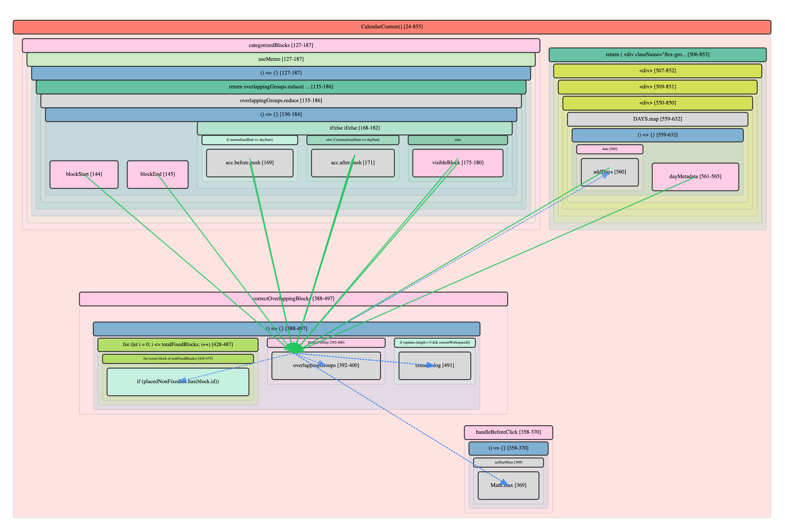

# React TypeScript Code Analysis VS Code Extension

Provides static analysis, visualization, and code navigation features for React + TypeScript projects within Visual Studio Code.

Example treemap of itself:

Example of reference graph:

## Overview

This extension analyzes source code and creates interactive treemap visualizations that help developers understand code structure, identify complexity hotspots, and navigate large codebases. The process consists of three main phases:

1. **Code Processing** - Parse and analyze source files
2. **Tree Building** - Create hierarchical data structures
3. **Tree Rendering** - Generate interactive visual treemaps

## Code Processing

The extension supports multiple file types and uses specialized parsers for each:

### Supported File Types

- **TypeScript/JavaScript** (`.ts`, `.tsx`, `.js`, `.jsx`) - Full AST analysis using TypeScript compiler API
- **CSS/SCSS** (`.css`, `.scss`) - Custom tokenizer and parser for stylesheets
- **Markdown** (`.md`, `.mdx`) - Parses document structure and content blocks

### Parser Selection

The system automatically selects the appropriate parser based on file extension via `buildScopeTree.ts`:

- TypeScript files → `buildScopeTreeTs.ts`
- CSS/SCSS files → `buildScopeTreeCss.ts`
- Markdown files → `buildScopeTreeForMarkdown.ts`

### AST Analysis (TypeScript)

For TypeScript files, the extension:

- Uses the TypeScript compiler API to generate Abstract Syntax Trees (AST)
- Walks the AST to identify scope boundaries and significant code constructs
- Categorizes nodes using `mapKindToCategory.ts` (Functions, Classes, Components, etc.)
- Handles complex constructs like conditional blocks, try/catch statements, and loops

### Token Analysis (CSS/SCSS)

For stylesheet files, the extension:

- Implements a custom tokenizer that recognizes CSS syntax
- Parses tokens into structured elements (selectors, rules, at-rules, variables)
- Supports SCSS-specific features (variables, mixins, functions, control directives)
- Tracks nested structures and maintains proper hierarchy

## Tree Building

The tree building phase converts parsed code into hierarchical `ScopeNode` structures:

### ScopeNode Structure

Each node contains:

- **id**: Unique identifier (`${filePath}:${startPos}-${endPos}`)
- **category**: Type classification (Function, Class, Variable, etc.)
- **label**: Human-readable name derived from code
- **location**: Start/end positions in source file
- **source**: Original code text
- **value**: Complexity metric (starts at 1 for leaf nodes)
- **children**: Array of child nodes
- **meta**: Additional metadata (props, parameters, etc.)

### Node Categorization

The system recognizes numerous node types:

- **Code Structure**: Program, Module, Class, Function, Block
- **React Elements**: ReactComponent, ReactHook, JSX elements
- **Control Flow**: IfStatement, TryStatement, ForLoop, etc.
- **Declarations**: Variable, Import, TypeAlias, Interface
- **CSS Elements**: Rule, Selector, AtRule, Property, Mixin
- **Markdown Elements**: Heading, Paragraph, CodeBlock, List

### Value Calculation

Node values represent complexity and are calculated recursively:

- **Leaf nodes**: Start with value = 1
- **Parent nodes**: Sum of all children values + 1
- This creates meaningful size representation where larger containers reflect their total complexity

### Tree Processing Options

Optional processing includes:

- **Synthetic Groups**: Group related nodes (Imports, Type definitions)
- **Filtering**: Include/exclude certain node types
- **Flattening**: Remove unnecessary nesting levels
- **Depth Limiting**: Control maximum tree depth for visualization

## Tree Rendering

The rendering phase converts hierarchical trees into interactive SVG treemaps:

### Layout Algorithm

The system uses a sophisticated hierarchical layout algorithm (`layoutHierarchical.ts`):

- **Bin Packing**: Treats layout as a 2D bin packing problem
- **Proportional Sizing**: Node dimensions reflect their relative values
- **Source Order Preservation**: Maintains original code structure ordering
- **Space Optimization**: Uses advanced algorithms to minimize wasted space

### Rendering Modes

Nodes can render in different modes based on available space:

- **Text Mode**: Full node with readable text labels (minimum 80x40px)
- **Box Mode**: Colored rectangle without text (minimum 20x20px)
- **None Mode**: Hidden when space is insufficient

### Visual Features

- **Color Coding**: Different colors for each node category (see Color Scheme below)
- **Hierarchical Borders**: Container borders to show grouping
- **Depth-Based Styling**: Opacity and stroke width adjust with nesting depth
- **Hidden Child Indicators**: Orange dots show when children are hidden due to space constraints

### Interactive Features

- **Click Navigation**: Single click opens detail drawer, Cmd+click jumps to source, Alt+click zooms into node
- **Search**: Real-time filtering with `/` key shortcut and visual highlighting
- **Zoom/Pan**: Mouse wheel zoom and drag panning with viewport controls
- **Tooltips**: Hover information including hidden children details
- **Export**: PNG image export and JSON data export

### Flat Rendering System

For performance, the system uses a flat rendering approach:

- Converts hierarchical layout to flat arrays of container and leaf nodes
- Renders in breadth-first order (containers first within each depth level)
- Assigns render order numbers for consistent layering
- Optimizes for smooth animations and interactions

## Features Summary

### Core Visualization

- **Interactive Treemap**: Navigate code structure visually with proportional sizing
- **Multi-File Support**: View multiple files from the same folder in grid layout
- **Responsive Design**: Automatically adapts to container size changes

### Search and Navigation

- **Real-time Search**: Filter nodes by content with live highlighting
- **Keyboard Shortcuts**: Quick access with `/` for search, number keys for depth control
- **Breadcrumb Navigation**: Easy depth level switching
- **Source Integration**: Jump directly to code locations

### Customization

- **Depth Control**: Adjust maximum tree depth (keys 1-9, 0 for unlimited)
- **Visual Settings**: Customize colors, borders, opacity, and layout options
- **Node Filtering**: Show/hide imports, types, literals, and other categories
- **Export Options**: Save as PNG or export underlying JSON data

### Color Scheme

The treemap uses a carefully designed color palette to distinguish different code elements:

- Functions and methods use coral/salmon tones
- React components use purple/magenta shades
- Variables use light pink
- Control flow uses green tones
- CSS elements use blue/purple theme
- Markdown elements use warm earth tones

## Search Feature

### Quick Usage

- Press `/` to focus search input
- Type to filter nodes by content (case-insensitive)
- Press `Escape` to clear search
- Yellow borders highlight matching nodes
- Parent paths to matches remain visible

### Search Behavior

- **Label Matching**: Searches node names and identifiers
- **Source Matching**: Searches actual code content
- **Path Preservation**: Shows parent nodes leading to matches
- **Live Updates**: Results update as you type

## Development

For development setup, testing guidelines, and contribution information, see the [Development Guide](docs/DEV.md).

For detailed technical specifications and implementation notes, see [OLD_NOTES.md](docs/OLD_NOTES.md).
