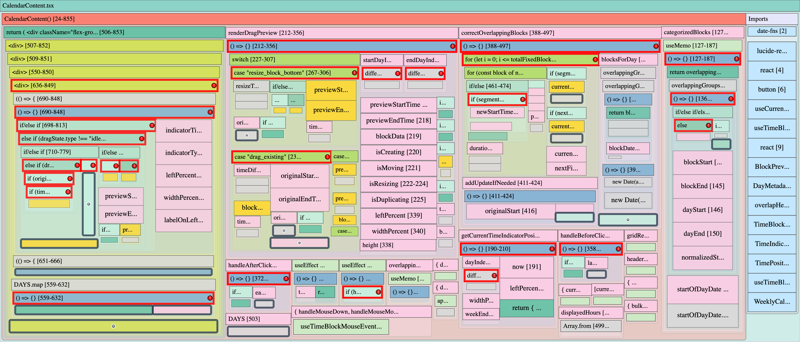

# React TypeScript Code Analysis VS Code Extension

Provides static analysis, visualization, and code navigation features for React + TypeScript projects within Visual Studio Code.

Example treemap of itself:



## Features (Planned)

- **Treemap Visualization**: Visualize your codebase structure using an interactive treemap.
  - Node sizes can represent lines of code or character counts, providing an intuitive overview of code distribution.
  - Color-coded categories for different code elements (modules, components, functions, etc.).
  - Interactive features like zoom, tooltips with detailed information (ID, category, value, source snippet), and customizable display settings.
  - Export the treemap as a PNG image or the underlying data as JSON.
- Component hierarchy visualization
- Hook and state inspection
- Props and data-flow tracing
- Module dependency graph
- Jump-to-definition enhancements

## Development

- Run `npm install` to install dependencies.
- Run `npm run watch` to start the TypeScript compiler in watch mode.
- Open the project in VS Code and press `F5` to launch the Extension Development Host.

## Testing

This project uses Vitest for testing.

- To run tests in watch mode (reruns on file changes):

  ```bash
  npm test
  ```

- To run tests once and exit:

  ```bash
  npm run test:once
  ```

- To update snapshots for existing tests:

  ```bash
  npm run test:once -- -u
  ```

  Or, if running a specific test file:

  ```bash
  npx vitest path/to/your/testfile.test.ts -u
  ```

## Contributing

(Add contribution guidelines later)
