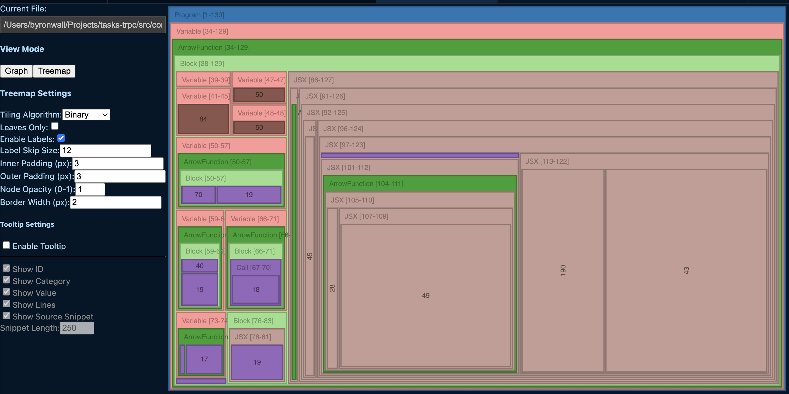

# Treemap notes

## Initial pass

First version generates tree maps with several options

### Improvements from here

Todo:

- All nodes should identify their type
- All nodes + containers should have more info in the label with a truncate - add the node type for JSX, variable name etc.
  - JSX = `
`
  - Function = `fn()`
  - ArrowFunction = `() => {}`
  - Variable = `[var name]`
  - Class = `[class name]`
  - Import = `[name of lib]`
  - Export = `[name of export]`
- Single left click should expand/collapse; cmd+click should open the file with a visual change in the node border
- Need to show if and other control flows as parents or differently
- Node sizes are not well determined - figure out how to keep things more consistent
- Tree map should probably render on the side of code - open existing editor when clicking.

Tree creation

- Add a symbol or marker to indicate if something is exported
- Give some ability to track props and other "incoming" edges
- Synthetic groups for the hooks is not useful - breaks seeing code - probably just remove those.
- Create a synthetic group for imports - ensure all code is visible on hover
- Create a synthetic group for types
- Drop group for mutations and hooks

Design:

- Set a min size to prevent things from getting too small
- Reduce border weight & recursion outline
  - 2 px borders for every level generate moiré patterns; switch to 1 px for children and 0 px for leaves, or draw only the hovered branch.
- Make the file path scannable
  - Break long paths into breadcrumbs and ellipsize middle segments; current string overflows on smaller widths.
- Introduce scale-aware typography
  - Auto-hide or truncate labels below a minimum pixel area; reveal full label on hover/focus.
  - Use a semi-transparent label background so text remains legible over coloured fills.
- Revise header and node color black/white based on background contrast
- Add overflow to the settings panel on left
- Give different colors to DOM elements vs. custom react elements
- Put a min height on elements so that text is visible if there's space somewhere

UX:

- Expose quick search / filter
  - Let me type “useState” and instantly highlight every hook invocation node.
  - Show a list of variable names and hover to show where they are used
- Add an on-hover tooltip or side legend for Program, Variable, ArrowFunction, etc.
- Export & share
  - Consider an HTML export that includes tooltips or other interactions
- Perf goals
  - Enforce < 200 ms initial render for 1 k-line files; if exceeded, lazy-render deeper levels.
